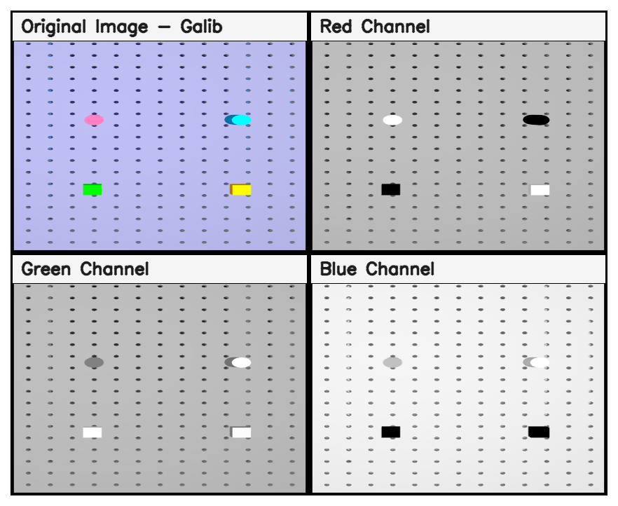
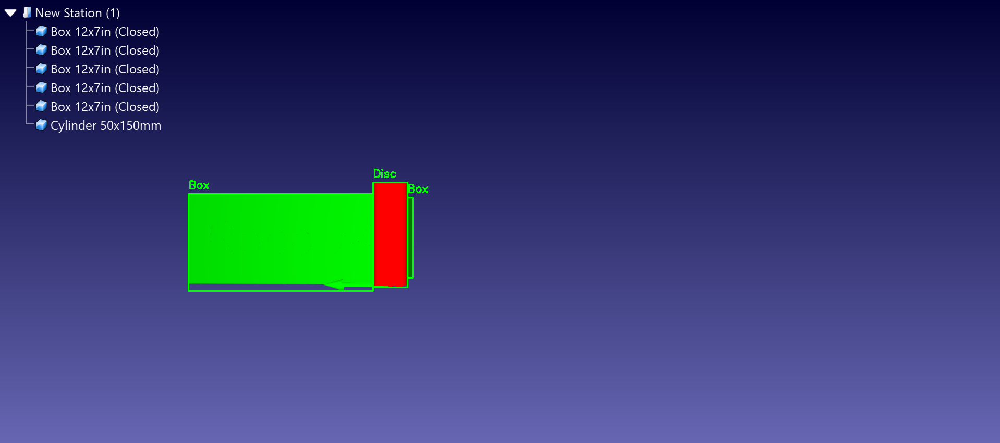

# Machine Vision – Week 1 Assignment

**Name:** Galib Bin Mahamud  
**Date:** 2026-03-28  

This repository contains my solutions for the Week 1 Machine Vision assignment using **OpenCV** and **RoboDK**.

---

## Task A – OpenCV Basics

The script `task-a.py` performs the following steps:

- Loads the RoboDK snapshot image
- Splits the image into **Red, Green, and Blue** channels
- Arranges the outputs in a **2 × 2 grid**
  - Original image (with name)
  - Red channel
  - Green channel
  - Blue channel
- Saves the final result as `taskA_grid.png`

**Output:**



---

## Task B – RoboDK + OpenCV Annotation

The script `task-b2.py` performs the following steps:

- Loads the RoboDK scene image
- Converts the image to **HSV color space**
- Detects selected objects using color masks
- Identifies:
  - **Disc**
  - **Box**
- Draws bounding rectangles around detected objects
- Adds labels, my name, and the current date
- Saves the final annotated result as `annotated.png`

**Output:**  



---

## Files Included

This repository contains:

- `task-a.py`
- `task-b2.py`
- `robot_view.png`
- `taskA_grid.png`
- `annotated.png`
- `requirements.txt`

---

## How to Run

Run the following commands:

```bash
python task-a.py
python task-b2.py
```
---

## Requirements

The project uses Python with OpenCV and NumPy.

To install the required packages, run:

```bash
pip install -r requirements.txt
```
---
## Findings and Learning Experience

- Learned difference between BGR and RGB
- Understood RGB channel separation  
- Used HSV color space for object detection  
- Applied contour detection to identify objects  
- Learned image annotation using OpenCV

---
## Lab Report

[View Lab Report](./Machine_Vision_Week_1_Lab_Report.pdf)
